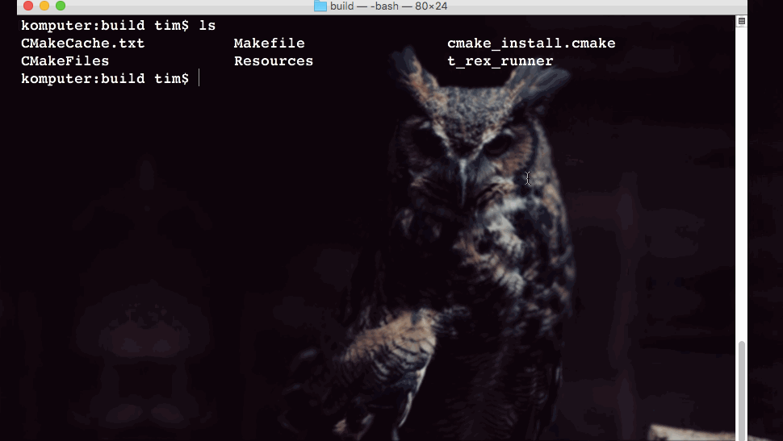

SDL2 Dynamic-link library required for building.

You may download it from [here](https://www.libsdl.org/download-2.0.php "SDL2")

## Building:

### Enter the folder named build

 
	cd build

### Generate MakeFile using cmake

	cmake ..

### Build by make

	make

## Running the program:

	./t-rex-runner
